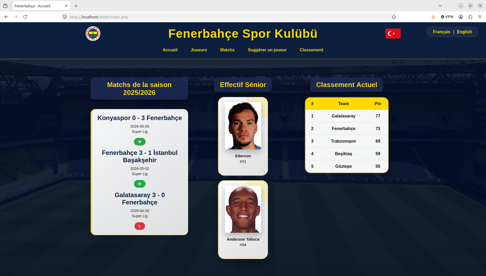
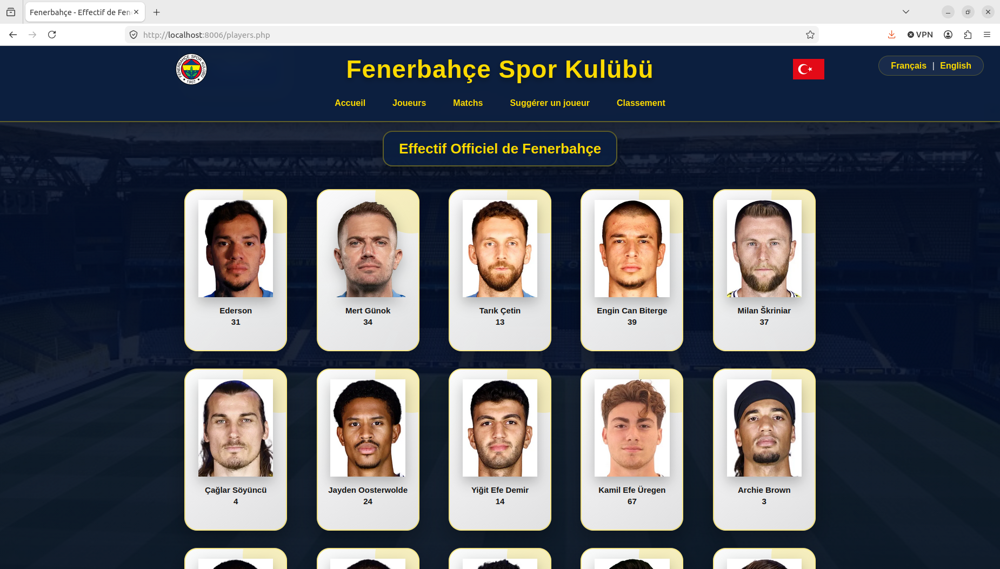
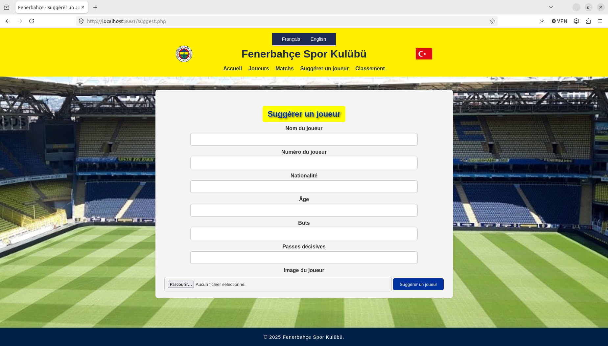

# Projet Web - Site Fenerbahçe Spor Kulübü

## Description

Fenerbahçe Player Tracker est un site web dédié au club **Fenerbahçe Spor Kulübü**.

Le projet permet :
- d’afficher l’effectif officiel,
- consulter les résultats récents,
- voir le classement actuel,
- rechercher des joueurs dynamiquement,
- suggérer de nouveaux joueurs via un formulaire interactif.

Le site est entièrement **responsive** et disponible en :
- 🇫🇷 Français
- 🇬🇧 English

---

## Fonctionnalités

- ⚽ Affichage de l’effectif officiel
- ⚽ Fiche détaillée pour chaque joueur
- ⚽ Recherche dynamique AJAX
- ⚽ Suggestions de joueurs par les utilisateurs
- ⚽ Upload sécurisé d’images
- ⚽ Classement dynamique
- ⚽ Résultats de matchs récents
- ⚽ Support multilingue (FR/EN)
- ⚽ Responsive Design
- ⚽ Base de données SQLite avec PDO
- ⚽ Protection contre les injections SQL et les failles XSS
---

## Technologies utilisées

- PHP
- SQLite
- PDO
- HTML5
- CSS3
- JavaScript
- AJAX / Fetch API

---
## Structure du projet

```text
.
├── assets
│   ├── CSS
│   │   ├── fenerbahce.jpeg
│   │   └── styles.css
│   ├── data
│   │   └── matches.json
│   ├── images
│   │   ├── fenerbahce.jpeg
│   │   ├── logo
│   │   ├── mourinho.jpg
│   │   ├── players
│   │   └── turquie.png
│   ├── PHP
│   │   ├── api
│   │   ├── database.db
│   │   ├── Database.php
│   │   ├── delete.php
│   │   ├── footer.php
│   │   ├── header.php
│   │   ├── lang
│   │   ├── lang.php
│   │   └── save_player.php
│   ├── README
│   │   ├── page1.png
│   │   ├── page2.png
│   │   └── page3.png
│   └── uploads
│       ├── cr7.jpeg
│       ├── dembele.jpeg
│       ├── guler.png
│       ├── mbappe.jpeg
│       ├── messi.jpeg
│       └── yildiz.jpeg
├── full-ranking.php
├── index.php
├── matches.php
├── player.php
├── players.php
├── README.md
├── suggested-player.php
├── suggest.php
└── update_fenerbahce_players_2025_2026.sql

```

---


## Lancer le projet en local

### Prérequis

- PHP installé
- Extension SQLite activée (`pdo_sqlite`)
- Navigateur web

### Installation SQLite (Ubuntu / Debian)

```bash
sudo apt install php-sqlite3
```

### Lancer le serveur local

Depuis le dossier du projet :

```bash
php -S localhost:8000
```

Puis ouvrir dans le navigateur :

```text
http://localhost:8000
```

---

## Aperçu du site

### Accueil



### Page joueurs



### Suggérer un joueur




## Auteur

Réalisé par **Müttaki SERTOGLU**

